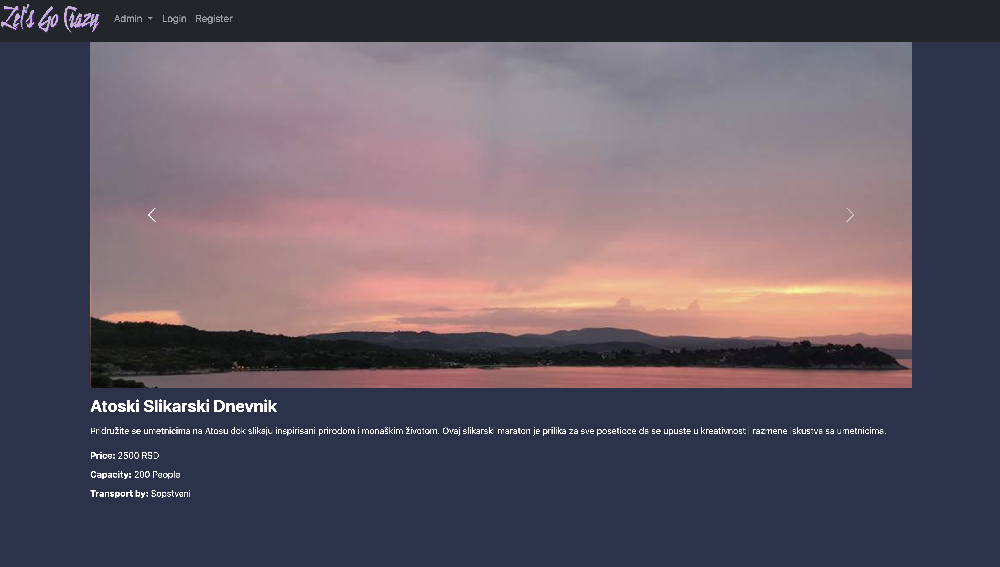
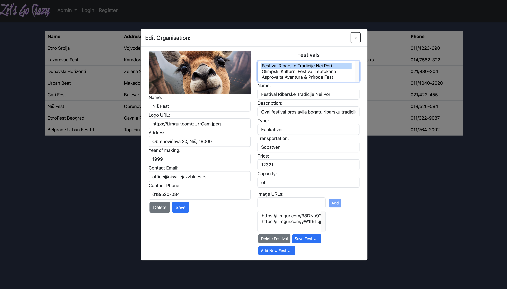

# Festival Showcase WEB

This is a simple web design project showcasing a responsive Festival Display website.  
The project was created as part of my first-year coursework to demonstrate proficiency in Angular Development (HTML, CSS, TypeScript).

---

## Table of Contents
- [Introduction](#introduction)
- [Features](#features)
- [Technologies Used](#technologies-used)
- [Installation](#installation)
- [Usage](#usage)
- [Preview](#preview)
- [License](#license)

---

## Introduction

The **Festival Showcase WEB** project is a dynamic, interactive website designed to highlight key aspects of a festival ecosystem.  
It incorporates responsive design principles and integrates with a Firebase database for dynamic data storage and retrieval.  
The project includes user authentication, data management, and an admin panel for managing the system.

---

## Features

- **Responsive Design**: Adapts seamlessly to desktop, tablet, and mobile devices.
- **Firebase Integration**: Stores festival data and retrieves it dynamically using Firebase's real-time database.
- **Interactive Navigation**: Smooth scrolling between sections and active highlights.
- **User Authenticaiton**: Includes login and register functionality.

---

## Technologies Used

- **Angular** (HTML, CSS, TypeScript)
- **Firebase** (for database integration)
- **Bootstrap** (for layout and styling)

---

## Installation

1. Clone the repository:
   ```bash
   git clone https://github.com/IgorAmi52/Festival-Showcase-WEB.git
2. Navigate to the project dictory:
   ```bash
   cd festival-showcase-web
3. Install dependencies:
   ```bash
   npm install

---

## Usage

1. Run the development server:
   ```bash
   ng serve
2. Open your browser and go to http://localhost:4200.

---

## Preview

### Festival Display
Here's a screenshot of a Festival Display page.



### Admin Panel 
Below is a screenshot of the admin edit panel for the selected organisation and it's festivals.



## License

This project is licensed under the MIT License.
